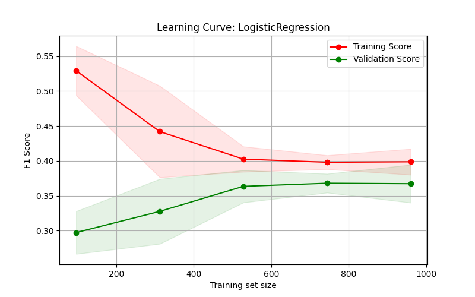
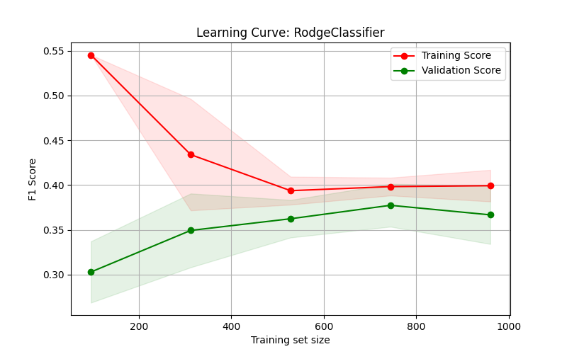

# Model Diagnostic: Learning Curves

## Project Overview
In this project, I evaluated two different machine learning models to predict customer churn. The goal was to diagnose the models' performance using **Learning Curves** and understand if they suffer from Bias or Variance.

## Steps Taken
1.  **Data Preprocessing**: I used `StandardScaler` for numeric features and `OneHotEncoder` for categorical features.
2.  **Model Comparison**: I compared **Logistic Regression** and **Ridge Classifier**.
3.  **Diagnostic Tool**: I generated learning curves with a 5-fold cross-validation and used the **F1-Score** as a metric.
4.  **Visualization**: I plotted the training and validation scores with confidence intervals (shadow areas).

## Visual Results
Below are the learning curves generated for each model:

### 1. Logistic Regression Curve

### 2. Ridge Classifier Curve

## Written Analysis

### 1. Model Diagnosis (Bias vs. Variance)
The learning curves for both Logistic Regression and Ridge Classifier show that the training and validation scores converge to a similar value (around 0.4), with only a small gap between them. This indicates low variance, as the model is not overfitting the training data. However, both scores are relatively low, which suggests high bias (underfitting). In other words, the models are too simple to capture the underlying patterns in the dataset.

### 2. Impact of Data Size
As the training set size increases, the validation score improves slightly at the beginning but then plateaus after around 600 samples. This flattening of the curve indicates that adding more data is unlikely to significantly improve performance. Since both curves have already converged and stabilized, the limitation is not due to lack of data but rather due to the model’s limited capacity.

### 3. Model Complexity and Next Steps
Increasing model complexity is likely to improve performance. Since the current models are underfitting (high bias), using more flexible models such as Random Forest or Gradient Boosting (e.g., XGBoost), or adding more informative features through feature engineering, could help capture more complex relationships in the data. Additionally, reducing regularization strength or introducing polynomial features may also improve performance.

### 4. Metric Justification
F1-score was used instead of accuracy because the telecom churn dataset is imbalanced. Accuracy can be misleading in such cases, while F1-score provides a better balance between precision and recall, making it more suitable for evaluating model performance on this task.